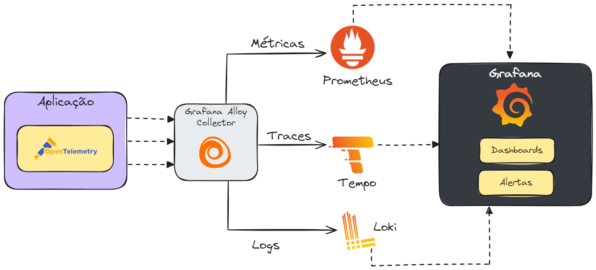
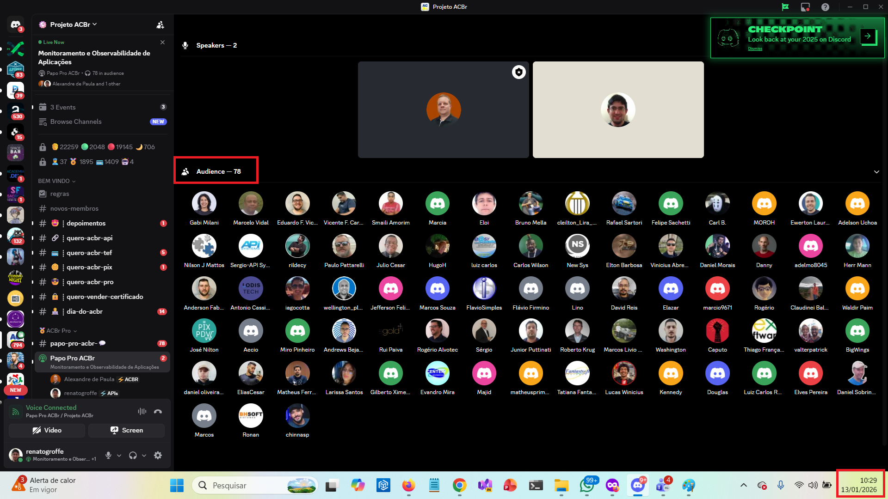
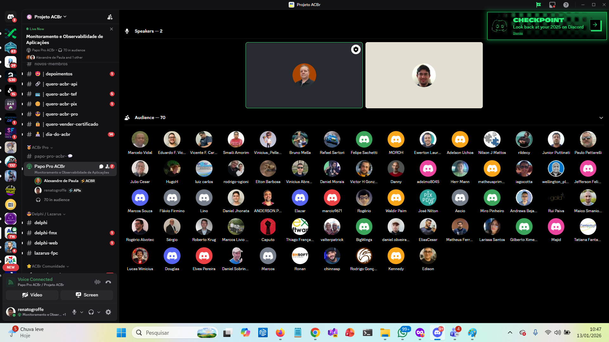
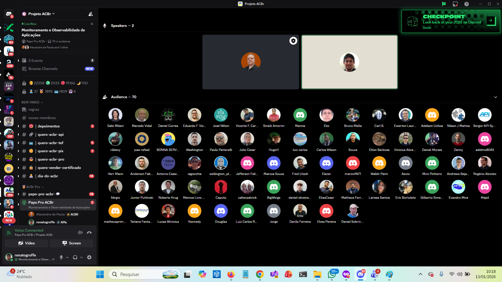
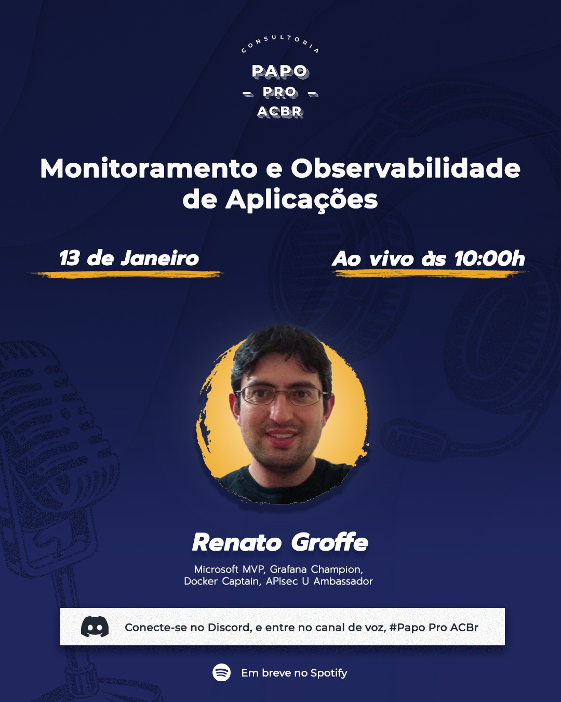

# monitoramento-observabilidade_papo-pro-acbr-2026-01
Free Content on Monitoring/Observability (Docker, Kubernetes, OpenTelemetry, Grafana, Azure) + Speaking Notes for the Papo Pro ACBr Podcast + Information about this online event.

Episode on **Spotify** (watch for free): https://open.spotify.com/episode/3Ds5bE27P57m3wUvIOslXf

---

### 📚 **References/Useful Links**
- [OpenTelemetry](https://opentelemetry.io)
- [OpenTelemetry + .NET](https://learn.microsoft.com/en-us/dotnet/core/diagnostics/observability-with-otel)
- [Grafana](https://grafana.com)
- [Grafana Alloy](https://grafana.com/docs/alloy/latest/)
- [Prometheus](https://prometheus.io)
- [Free Content from the presentation "Unified Observability with OpenTelemetry: tracing of distributed applications in .NET and other stacks - TDC Summit São Paulo 2025"](https://github.com/renatogroffe/opentelemetry_tdc-sp-2025)
- [Free Content from the presentation "OpenTelemetry + Grafana: observability, monitoring, innovations with Grafana Alloy... - DevOps Experience 2025-05"](https://github.com/renatogroffe/opentelemetry-grafana_devops-experience-2025-05)
- [Playlist with videos about using Grafana with various technologies - YouTube - .NET Channel](https://www.youtube.com/playlist?list=PL1FNyHZz1VQGvQYEPt1auW9xv790Kloi2)
- [Over 40 repositories on GitHub with content about using Grafana with technologies such as .NET/C#, Java, Node.js, Python, Kubernetes and Microsoft Azure services](https://github.com/renatogroffe?tab=repositories&q=grafana&type=&language=&sort=)
- [Why use Grafana for monitoring Azure resources? - Article - AzureBrasil cloud](https://www.azurebrasil.cloud/blog/grafana-monitoramento-azure/)

In these materials you will find a comprehensive overview of using the Grafana stack with various technologies:

---

## Podcast Speaking Notes: Application Monitoring and Observability - Papo Pro ACBr

### 📌 **Introduction**
- Presentation of the topic and relevance in the current context
- Difference between Monitoring and Observability
- Why this is critical for modern applications

---

### 🎯 **Segment 1: Fundamental Concepts**

#### Monitoring vs Observability
- Monitoring: Predefined metrics
- Observability: Complete understanding of the system
- Why both are necessary

#### The Three Pillars of Observability
1. **Logs** - Detailed records of events
2. **Metrics** - Quantitative performance data
3. **Distributed Tracing** - Tracing of requests across services

---

### 🛠️ **Segment 2: Tools and Technologies**

#### OpenTelemetry
- Open standard for instrumentation
- Vendor-agnostic
- Importance for portability

#### Modern Observability Stack
- **Prometheus** - Metrics collection
- **Grafana** - Visualization and dashboards
- **Grafana Loki, Azure Log Analytics, Elasticsearch/ELK Stack** - Log analysis
- **Grafana Tempo, Jaeger, Zipkin, Elastic APM** - Distributed tracing
- **Azure Monitor, Application Insights, Dynatrace, DataDog, New Relic, AWS CloudWatch** - Commercial solutions

---

### 💡 **Segment 3: Best Practices**

#### Effective Implementation
- Proper log structuring
- Definition of relevant metrics
- Well-configured alerts (avoiding noise)
- SLOs and SLIs

#### Common Challenges
- Storage costs
- Data volume
- Information correlation
- Learning curve of tools

---

### 🌐 **Segment 4: Use Cases and Practical Examples**

- Microservices monitoring
- Anomaly detection
- Performance troubleshooting
- Regulatory compliance
- End-user experience

---

### 🎤 **Closing**

- Summary of main points
- Recommendation for first steps
- Useful resources and documentation
- Call-to-action for listener feedback

---

## Event Information

Presentation Title: **Application Monitoring and Observability**

Date: **01/13/2026 (Tuesday)**

Event Type: **Online**

Broadcasting Tool: **Discord**

Technologies and Topics Covered: **Monitoring, Observability, Logs, Metrics, Traces, Distributed Tracing, OpenTelemetry, Prometheus, Grafana, Grafana Loki, Grafana Tempo, Grafana Alloy, Azure Monitor, Application Insights, Azure Log Analytics, Elastic APM, Dynatrace, DataDog, New Relic, AWS CloudWatch, Docker, Containers, Docker, Kubernetes, Linux, Windows, .NET, Delphi, Java, Node.js, Python...**

Number of Participants: **78 people (peak audience throughout the live)**

Access this [**link**](/img/) to view all presentation photos/screenshots.

Event Link: [**Instagram**](https://www.instagram.com/p/DTbD-VzjUjo/)

Talk Recording: [**Spotify**](https://open.spotify.com/episode/3Ds5bE27P57m3wUvIOslXf)

I would like to extend my gratitude to my friends **Alexandre de Paula** and **Daniel Morais** for the invitation, as well as to the dozens of community members of the **ACBr Project** who attended the event during a Tuesday morning (01/13/2026).

---

Below are screenshots from the presentation.

